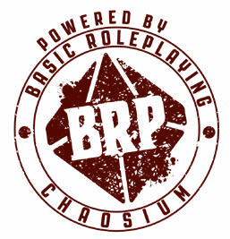

Basic Roleplaying Universal Game Engine

ORC Content Document

## Credits

Based on the Basic Roleplaying system created by Steve Perrin, Steve Henderson, Warren James, Greg Stafford, Sandy Petersen, Ray Turney, Lynn Willis

**Authors** Jason Durall and Steve Perrin

**Producer** Neil Robinson

**Additional Credits** Daria Pilarczyk, Rick Meints, Michael O’Brien, and Jeff Richard

**Special Thanks** Ken St. Andre, Ken Austin, William Barton, Bill Dunn, Ken Finlayson, Mark L. Gambler, Sam Johnson, William Jones, Rodney Leary, Ben Monroe, Gordon Monson, Sarah Newton, Sam Shirley, Mark Morrison, and Richard Watts

Published in the United States of America by Chaosium Inc.

3450 Wooddale Court, Ann Arbor, MI 48104

chaosium.com

BASIC ROLEPLAYING: UNIVERSAL GAME ENGINE

Copyright © 2023 by Chaosium Inc. All rights reserved.

Basic Roleplaying is copyright © 1981, 1983, 1992, 1993, 1995, 1998, 1999, 2001, 2004, 2008, 2010, 2023 by Chaosium Inc.; all rights reserved.

Basic Roleplaying is the trademark of Chaosium Inc.

Chaosium Inc. and the Chaosium logo are registered trademarks of Chaosium Inc.

This product is licensed under the ORC License held in the Library of Congress at TX000 [number tbd] and available online at various locations including [www.chaosium.com/orclicense](https://www.chaosium.com/orclicense), www.azoralaw.com/orclicense, www.gencon.com/orclicense and others. All warranties are disclaimed as set forth therein.

This product is the original work of Chaosium.

If you use our ORC Content, please also credit us as follows:

With a very few exceptions (trademarked terms), the text of BASIC ROLEPLAYING: UNIVERSAL GAME ENGINE is available for personal and commercial use under the ORC license.
