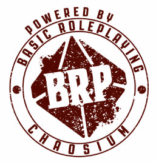

# BR:UGE

#### बेसिक रोलप्लेइंग: यूनिवर्सल गेम इंजन

###### ओआरसी (ORC) कंटेंट डॉक्यूमेंट

## क्रेडिट्स

स्टीव पेरिन, स्टीव हेंडरसन, वॉरेन जेम्स, ग्रेग स्टाफर्ड, सैंडी पीटरसन, रे टर्नी, लिन विलिस द्वारा निर्मित बेसिक रोलप्लेइंग सिस्टम पर आधारित।

**लेखक:** जेसन डुरल और स्टीव पेरिन

**निर्माता:** नील रॉबिन्सन

**अतिरिक्त क्रेडिट्स:** डारिया पिलारजिक, रिक मिंट्स, माइकल ओ'ब्रायन और जेफ रिचर्ड

**विशेष धन्यवाद:** केन सेंट आंद्रे, केन ऑस्टिन, विलियम बार्टन, बिल डन, केन फिनलेसन, मार्क एल. गैंबलर, सैम जॉनसन, विलियम जोन्स, रॉडनी लीरी, बेन मोनरो, गॉर्डन मॉन्सन, सारा न्यूटन, सैम शर्ली, मार्क मॉरिसन और रिचर्ड वाट्स

प्रथम अमेरिकी संस्करण, 2023, संस्करण 1.03

संयुक्त राज्य अमेरिका में कैओसियम इंक. द्वारा प्रकाशित

3450 वुडडेल कोर्ट, एन आर्बर, एमआई 48104

chaosium.com

बेसिक रोलप्लेइंग

यूनिवर्सल गेम इंजन

कॉपीराइट © 2024 कैओसियम इंक. द्वारा। सर्वाधिकार सुरक्षित।

बेसिक रोलप्लेइंग कॉपीराइट © 1981, 1983, 1992, 1993, 1995, 1998, 1999, 2001, 2004, 2008, 2010, 2023, 2024 कैओसियम इंक. द्वारा; सर्वाधिकार सुरक्षित।

बेसिक रोलप्लेइंग, कैओसियम इंक. का ट्रेडमार्क है।

कैओसियम इंक. और कैओसियम लोगो, कैओसियम इंक. के पंजीकृत ट्रेडमार्क हैं।

यह उत्पाद लाइब्रेरी ऑफ कांग्रेस में TX-307-067 पर स्थित ओआरसी (ORC) लाइसेंस के तहत लाइसेंस प्राप्त है और www.chaosium.com/orclicense, www.azoralaw.com/orclicense, www.gencon.com/orclicense तथा अन्य स्थानों पर ऑनलाइन उपलब्ध है। इसमें निर्धारित अनुसार सभी वारंटियों का खंडन किया गया है। यह उत्पाद कैओसियम का मूल कार्य है।

यदि आप हमारे ओआरसी (ORC) कंटेंट का उपयोग करते हैं, तो कृपया हमें निम्नानुसार क्रेडिट दें:

पावर्ड बाय बीआरपी (Powered by BRP) लोगो

बहुत कम अपवादों (ट्रेडमार्क किए गए शब्दों) को छोड़कर, बेसिक रोलप्लेइंग: यूनिवर्सल गेम इंजन का पाठ ओआरसी (ORC) लाइसेंस के तहत व्यक्तिगत और व्यावसायिक उपयोग के लिए उपलब्ध है।